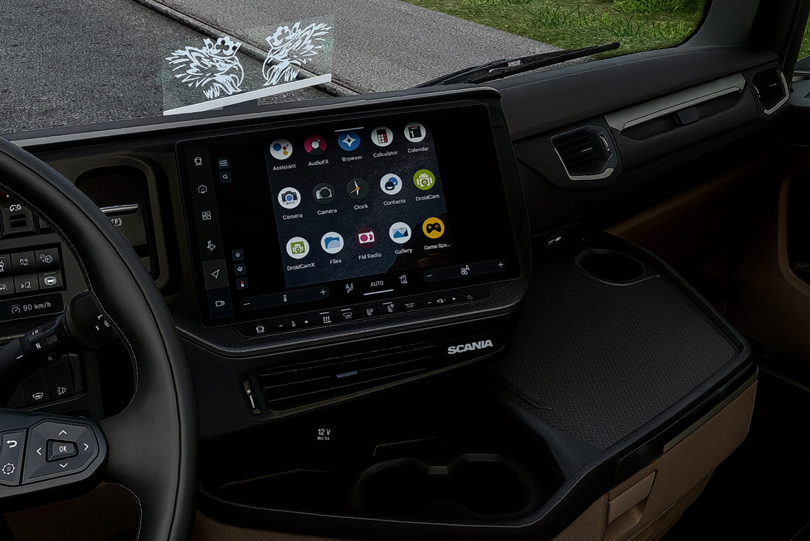
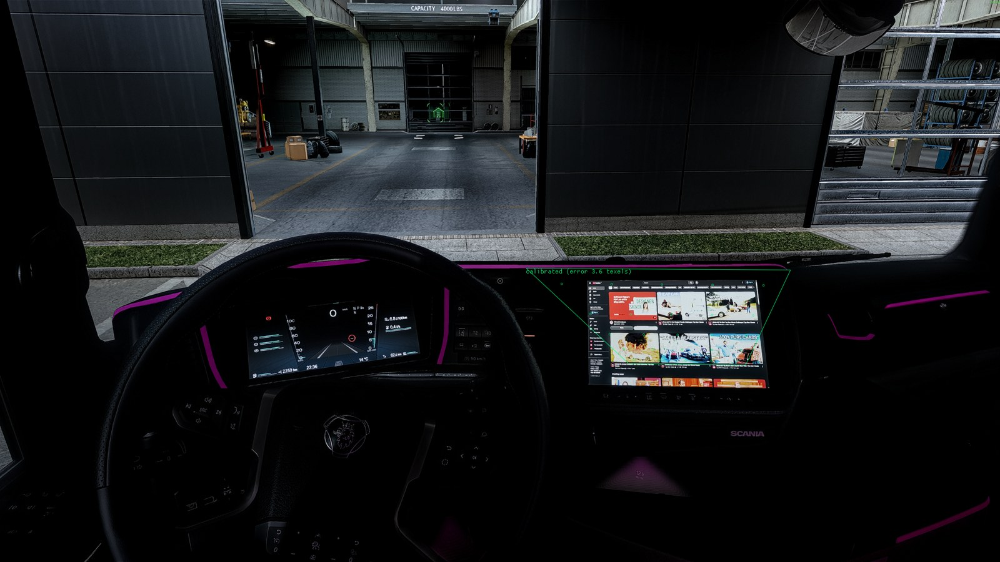

# CabCast for Euro Truck Simulator 2

Your Android phone, or a PC browser (YouTube, Spotify, Google Maps...), live on the truck's navigation screen, and usable from inside the game with an in-game cursor and your keyboard.

| Android phone | PC browser (YouTube) |
|---|---|
|  |  |

**Demo video:** https://www.youtube.com/watch?v=eeObnMjJtiY

## Features

- **Two sources:**
  - **Android phone** over USB, mirrored with [scrcpy](https://github.com/Genymobile/scrcpy).
  - **PC browser**: a Chrome or Edge app window with its own profile, so you sign in once.
- **In-game cursor:** press F10, point at the cab screen, then click, drag, scroll and type. Right click = back.
- **Automatic setup:**
  - Finds which in-game texture is the navigation screen.
  - Calibrates where it is on your monitor.
  - Detects which part of the screen is visible and which way the picture should face.
- **Sharp on small screens:** the picture can be rendered at a higher resolution than the game's own screen texture.
- **Lightweight:** frame-rate capped pipeline, off the game's render thread and at low priority.
- **Sound:** the source's audio follows a volume slider in the add-on.

## Install

1. Download `CabCast.zip` from [Releases](../../releases) and extract it.
2. Close the game and double-click **`Install CabCast.bat`**. The installer:
   - finds ETS2 in any of your Steam libraries;
   - installs ReShade with add-on support, keeping or updating an existing one;
   - installs the add-on and downloads scrcpy (adb is included with it).
3. In game:
   1. Press `Home`, open the **Add-ons** tab, then **DBM CabCast**.
   2. Look at the navigation screen and click **Detect screen**.
   3. Pick a source.

| Key | Action |
|---|---|
| F10 | cursor on the screen (F10 twice = recalibrate) |
| Esc | leave cursor mode |
| F9 | show / hide |

**Phone:** enable USB debugging. Go to Settings > About phone and tap *Build number* 7 times, then turn on Settings > Developer options > *USB debugging*. Plug in the cable and tap *Allow*.

Windows SmartScreen may warn about the unsigned `.bat`. Choose *More info*, then *Run anyway*. To remove everything, run `Uninstall CabCast.bat`.

**Requirements:** Windows 10/11, Euro Truck Simulator 2 (DirectX 11), and an Android phone or Chrome/Edge.

## How it works

```
 phone (scrcpy) / browser window
        |  Windows.Graphics.Capture (own D3D11 device, rate-capped GPU readback)
        v
 converter thread: scale + letterbox into the visible area, sRGB 8-bit fast path, mip chain
        |
        v  ReShade add-on API (game render thread)
 upload -> own texture, swapped into the 3D cab draw calls in place of the game's map texture
        |
        v
 truck screen  <--  in-game cursor: screen pixel -> homography -> texture texel -> source window pixel
                       scrcpy: window messages      browser: Chrome DevTools Protocol (WebSocket)
```

### Technical challenges

- **Finding the screen.** The cab screens are ordinary render targets among dozens of others.
  - **Detect screen** shows a test pattern on each candidate in turn and compares backbuffer shots.
  - The candidate that lights up one compact area where you look is the screen.
  - Full-screen post-processing buffers are rejected.
- **Calibration without access to the game's geometry.**
  - The add-on cycles 8 patterns on the screen: dark, a 5×5 marker grid, 5 bit planes and a full fill.
  - Each marker is identified by its on/off sequence, so markers hidden by the bezel or the steering wheel simply drop out.
  - A **RANSAC homography** maps monitor pixels to texture texels, typically within 1–3 texels.
  - The full-fill pattern shows which part of the texture is actually visible, so the picture is fitted into that area.
  - The orientation (flipped or mirrored) is derived from the homography.
- **Tone mapping.** Bloom turns pure magenta markers pink (255,134,255). The color test accepts that.
- **Frame pacing.** The first version kept average FPS but felt like slow motion, because a float conversion of every frame kept a CPU core busy. Fixes:
  - integer-only conversion;
  - a swap instead of a copy of ~3 MB per frame on the render thread;
  - capture, conversion and upload capped (30 fps by default), with extra frames dropped before the GPU readback;
  - below-normal thread priority.
- **Input to a hidden window.**
  - **scrcpy (SDL):** clicks go as window messages. SDL takes the click position from the last mouse-move message, so every click is preceded by a move.
  - **Chromium** ignores posted mouse messages. The add-on includes a small **Chrome DevTools Protocol** client (WinHTTP WebSocket) that sends input and reads the page viewport, which is used to crop the title bar.
- **Robustness.**
  - Every helper process runs in a kill-on-close job object.
  - The capture follows whichever window that job owns.
  - Conversion errors never reach the game.

## Build

Needs Visual Studio 2022 (or Build Tools) with the C++ workload. Run `build.bat`; the output is `out\dbm_phone.addon64`.

```
src/dbm_phone.cpp   add-on: screen detection, injection, calibration, cursor, UI
src/capture.*       Windows.Graphics.Capture of a window (or of any window of a job)
src/cdp.*           minimal Chrome DevTools Protocol client
installer/          one-click installer (PowerShell)
third_party/        ReShade add-on API headers (BSD-3-Clause), Dear ImGui header (MIT)
```

## Credits

- [ReShade](https://reshade.me) by crosire
- [scrcpy](https://github.com/Genymobile/scrcpy) by Genymobile
- [Dear ImGui](https://github.com/ocornut/imgui)

ReShade and scrcpy are downloaded by the installer from their official sources.

Not affiliated with SCS Software. Euro Truck Simulator 2 is a trademark of SCS Software.

## License

MIT
